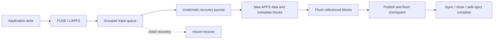

# LAPFS

**An experimental FUSE beta for reading and writing APFS on Linux**

[한국어](README.md) · [English](README.en.md)

<p align="center"></p>

<p align="center">
  <a href="https://github.com/JUNJOONHWAN/LAPFS/releases/tag/v0.3.0-beta.16"></a>
  
  <a href="LICENSE"></a>
</p>

LAPFS exposes an APFS device as a FUSE filesystem on Linux ARM64. The public beta was built on a DGX Spark/GB10 and passed a bounded read/write mount and move/delete tests with disposable files on a Corsair external volume.

> **Data safety:** This is beta software. Keep a separate backup and do not use it as the only copy of important data. Sudden unplug and power-loss durability have not been qualified. Review the supported subset before use.

[Download beta.16](https://github.com/JUNJOONHWAN/LAPFS/releases/tag/v0.3.0-beta.16) · [Architecture](docs/architecture.html) · [Recovery and safe eject](docs/RECOVERY.md) · [Feature limits](docs/LIMITATIONS.md) · [Performance and change report](docs/BETA16_MOVE_DELETE.md)

## At a glance

| | beta.16 |
|---|---|
| Version | `0.3.0-beta.16` · GitHub prerelease |
| Runtime | Linux ARM64 · FUSE3 · built on DGX Spark/GB10 |
| APFS write scope | One unencrypted volume in a supported format, without snapshots |
| Verified | File read/write, move and grouped-delete tests, SHA checks |
| License | GPL-3.0-only |
| Still unqualified | Mac roundtrip, power loss, long-duration and large-volume load |

## Features

| Area | Supported operations | Scope |
|---|---|---|
| Read | Files, directory listings, symlinks, range reads beyond 4 GiB | Up to 8 MiB read-ahead cache |
| File writes | Create, copy, range overwrite, append, unlink of closed files | Ordinary files; no whole-file staging required for large files |
| Directories | Create and remove empty directories | Direct removal of non-empty directories is unsupported |
| Move and rename | Same-volume file/directory move, rename, and replacement of a closed target | Disposable-image tests and a Corsair move test passed |
| Metadata | chmod, atime/mtime, symlink creation/removal | Not full POSIX metadata compatibility |
| Transfer tools | `rsync -a` for ordinary files, directories and symlinks | Qualified for the mounted user's ownership |
| Recovery and logs | Persistent work queue, undo/redo journal, JSONL error log, recovery and safe-eject tools | Error logs are not recovery data |

## Write modes and durability

The default mode is `--grouped-writes`. FUSE writes are grouped in memory; APFS changes are committed at `fsync`, file close, and normal unmount. An acknowledged write in this mode may still be lost if the device is unplugged before it is committed.

| | Default `--grouped-writes` | `--durable-writes` |
|---|---|---|
| Input staging | DGX RAM queue; durable undo journal | DGX local input log; durable undo/redo |
| Device commit | Grouped at `fsync`, close, and normal unmount | APFS changes commit at `fsync` and close |
| Sudden unplug | Uncommitted RAM input may be lost | Recovery may need the local input log |
| Normal unmount | Commit pending work and sync device | Commit pending work and sync device |

Both modes use copy-on-write, checksums, journal recovery and ordered device flushes. They cannot guarantee persistence if a device or USB bridge falsely reports that a flush succeeded. See [write path and recovery limits](docs/NATIVE_COW_IMPACT.md).

## How a write reaches APFS

1. An application's `write()` enters LAPFS through FUSE. The default grouped mode holds input in DGX RAM. `--durable-writes` first saves input to a log on the DGX internal disk.
2. LAPFS prepares a bounded APFS transaction. Copy-on-write (CoW) writes changed data and metadata to new blocks and prepares a recovery journal.
3. LAPFS flushes the new blocks and their references, publishes a new APFS checkpoint (NX), and flushes again. The completion boundary for `fsync`, close, or normal unmount is returned after that stage completes.



This sequence preserves the previous checkpoint while LAPFS prepares a recoverable change. Software cannot prove that a device or USB bridge truly persisted a successful final flush to nonvolatile media.

## Why small writes and deletes take longer

- An APFS update changes more than file data. LAPFS must update catalog records, extent references, allocation information and checkpoints. CoW avoids overwriting the previous blocks, but it must prepare and flush new blocks and references.
- Frequent 10 KiB writes create many transactions, metadata updates and synchronization points relative to the amount of input. On Corsair beta.14, a 16 MiB/10 KiB-write test reached 27.28 MiB/s and the OS-observed write volume was 2.94 times the input size.
- Grouped mode combines requests to reduce synchronization overhead. At `fsync`, close and safe eject, APFS changes still have to be committed. `--durable-writes` persists every input to a DGX local log, adding synchronization work to workloads with many small writes.
- Delete is also a metadata transaction. LAPFS updates the catalog entry, extent references, allocation state and checkpoint. beta.16 groups up to eight consecutive deletes. On Corsair, a batch commit took about 0.31–0.36 seconds; 100 delete calls took 4.265 seconds. The last four files were committed when the test directory was removed.
- Read-ahead reduces round trips for sequential and repeated reads. The measured 818–912 MiB/s was a 1 MiB read from an APFS image on the DGX internal disk. Raw Corsair O_DIRECT reads were 803 and 1,109 MiB/s, but used different paths and device locations; these are not directly comparable APFS file-read measurements. A historical 83 MiB MOV read on Corsair at beta.9 measured 50.05 and 54.93 MiB/s, before read-ahead. A same-condition beta.16 Corsair file-read result is not available.
- The 20 Gbps USB label is a theoretical link bit rate. Application file I/O also passes through APFS operations, synchronization boundaries, FUSE and device flush latency.

Large sequential files are more efficient than workloads with frequent small random updates. For ordinary backups, use the qualified subset of `rsync -a --progress`, close the files, and eject normally when the transfer finishes. A progress indicator shows transfer progress; it does not mean safe eject has completed.

## Performance measurements

Read each result together with its workload and storage path. Local APFS-image numbers are not USB throughput. The beta.14 hardware measurements are not a beta.16 performance guarantee.

| Workload | Result | Conditions and interpretation |
|---|---|---|
| Large sequential writes | 112–118 MiB/s; 1.293–1.297 OS-observed write bytes per input byte | Physical Corsair, beta.14, three 256 MiB files, 1 MiB writes, `fsync`, close and SHA checks |
| Small sequential writes | 27.28 MiB/s; 2.94x OS-observed write volume per input byte | Physical Corsair, beta.14, 16 MiB file, 10 KiB writes; small writes remain slow |
| Small-write history | beta.8 11.54–18.43 → beta.9 54.06–54.16 MiB/s | DGX internal 1 GiB APFS image, 10 KiB writes, `fsync` and close; not USB results |
| Historical APFS file read | 50.05 / 54.93 MiB/s | An 83 MiB MOV on Corsair, beta.9, before read-ahead; no same-condition beta.16 result |
| Read-ahead cache, image | beta.9 464–530 → beta.10 818–912 MiB/s | DGX internal APFS image, 1 MiB reads; not USB performance |
| USB link and raw reads | SuperSpeed Plus Gen 2x2/UAS; O_DIRECT reads of 803 and 1,109 MiB/s | Two 256 MiB reads at different device locations; not directly comparable to APFS file reads |
| Deletes, image test | 100 empty files: 1.646–2.008 s (beta.15) → 0.331–0.420 s (beta.16), 3.92–6.07x | Same image, DGX and optimized build; two paired runs. beta.16 commits up to eight deletes per transaction |
| Deletes, Corsair | 4.265 s for 100 delete calls on 4 KiB files | One beta.16 hardware run. The last four were flushed when the test directory was removed; no beta.14/15 hardware baseline |
| Move, Corsair | 0.428 s read-only probe; 0.432 s for an actual move of a 64 KiB test file | Probe made zero source writes; actual move preserved SHA and inode |

The 20 Gbps USB link rate is a theoretical bit rate, not APFS write speed or sustained file throughput. See [read measurements](docs/READ_AHEAD.md), [write amplification](docs/WRITE_AMPLIFICATION.md), [beta.14 hardware results](docs/CHECKSUM_PERFORMANCE.md), and [beta.16 move/delete results](docs/BETA16_MOVE_DELETE.md) for test conditions.

## Architecture and storage locations


| Location | Contents |
|---|---|
| DGX RAM | Uncommitted input queue in the default mode |
| DGX internal disk | Session state, work queue, undo/redo and recovery records, error logs |
| APFS device | File data and APFS metadata/checkpoints |

The default logical input queue uses two 32 MiB groups. The recovery journal has a separate 128 MiB batch limit and checks free space on the internal disk. These are not a total RAM limit. See the [operations manual](docs/RECOVERY.md) for session paths and safe eject/recovery procedures.

## Download and verify

The [GitHub beta.16 release](https://github.com/JUNJOONHWAN/LAPFS/releases/tag/v0.3.0-beta.16) provides source, a Linux ARM64 binary, a build receipt and SHA256 sums.

```bash
gh release download v0.3.0-beta.16 \
  --repo JUNJOONHWAN/LAPFS \
  --dir lapfs-beta16
cd lapfs-beta16
sha256sum -c SHA256SUMS
tar -xzf lapfs-0.3.0-beta.16-linux-arm64-gnu.tar.gz
./lapfs/bin/lapfs --version
```

The prebuilt binary requires Linux ARM64, glibc 2.39 or later, `libgcc_s`, `/dev/fuse`, and `fusermount3`. Read the device identification and safe-eject instructions before mounting a physical device. Physical-device commands must use the device-specific enrollment values.

### Build from source

```bash
git clone https://github.com/JUNJOONHWAN/LAPFS.git
cd LAPFS
cargo build --locked --offline --release --bin lapfs
./target/release/lapfs --version
```

Run source tests only against a disposable fixture and local disk space. Do not use a real APFS device as a test target.

## Mac/Linux operating workflow

1. Eject the external device normally in macOS, then connect it to Linux. Do not let both operating systems write to the APFS volume at the same time.
2. On the DGX, use `inspect` to read the by-id partition and APFS container UUID, then enroll the device. Select the APFS partition rather than the whole disk.
3. Mount the enrolled target at its configured path and use a new session directory on a separate internal disk. Read, copy, and rename files through the FUSE mount.
4. Close applications and files. In grouped mode, `fsync` and close commit APFS changes. Do not unplug based only on a copy tool's progress indicator.
5. Run the packaged safe-eject procedure. Disconnect only after it returns `ready_to_disconnect`, then connect the device to macOS.
6. After using the disk on macOS, eject it normally before reconnecting it to the DGX. If the prior DGX session is incomplete, recover it with the same DGX-local recovery path before starting a new session.

Exact enrollment, mount, eject and error-recovery commands are in the [operations manual](docs/RECOVERY.md). Preserve the error log and session journal when a mount or write fails.

## Compatibility and limits

Writes currently support a limited APFS subset centered on ordinary files. Truncating to a new size is limited to 8 MiB; large copy, append, and range-write operations are chunked without staging the whole file at once. Encrypted volumes, snapshots, containers with multiple APFS volumes, and mutations of shared, cloned, hard-linked, compressed, sparse or special files are unsupported. Open-file unlink, direct removal of non-empty directories, writable mmap, arbitrary xattrs/ACLs, `chown` to another owner, and full `cp -a` semantics are also unsupported.

- Never delete a session queue or recovery journal for an incomplete operation.
- When moving a device between macOS and Linux, unmount it normally and verify ownership before connecting it to the other system.
- The beta.16 Corsair check was a read-only preflight and small isolated-file tests. A Mac roundtrip, power-loss behavior and long-duration qualification for different USB bridges remain untested.
- Databases and arbitrary application save formats are not qualified.

See [all supported limits](docs/LIMITATIONS.md) and the [recovery manual](docs/RECOVERY.md).

## Validation summary

- beta.16 passed move/delete and crash-recovery tests on a 3,000-file APFS image, Linux FUSE checks, and macOS `fsck_apfs -n` checks.
- Corsair: after a normal beta.14 unmount, the beta.16 read-only move probe made zero writes to the source. The RW mount, 64 KiB move SHA/inode check, and delete canary passed. No existing files were modified.
- Not yet qualified: beta.16 device roundtrip back to macOS, physical power loss, long or repeated TB-scale writes, and combinations of USB bridges and kernels.

The [beta.16 validation report](docs/BETA16_MOVE_DELETE.md) contains the detailed receipts and before/after impact.

## License and upstream sources

LAPFS is distributed under **GPL-3.0-only**. Upstream sources and modifications are listed in [UPSTREAM.md](UPSTREAM.md); notices are in [THIRD_PARTY_NOTICES.md](THIRD_PARTY_NOTICES.md). LAPFS is not affiliated with or certified by Apple or NVIDIA.
