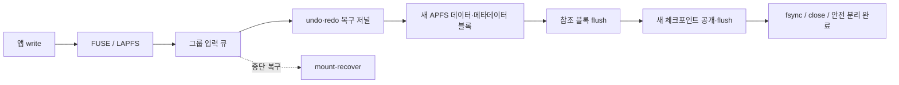

# LAPFS

**Linux에서 APFS 볼륨을 읽고 쓰는 실험용 FUSE 베타**

[한국어](README.md) · [English](README.en.md)

<p align="center"></p>

<p align="center">
  <a href="https://github.com/JUNJOONHWAN/LAPFS/releases/tag/v0.3.0-beta.16"></a>
  
  <a href="LICENSE"></a>
</p>

LAPFS는 Linux ARM64에서 APFS 장치를 FUSE 파일시스템으로 제공하는 공개 베타입니다. DGX Spark/GB10의 Corsair 외장 볼륨에서 읽기·쓰기 마운트와 제한된 이동·삭제 canary를 확인했습니다.

> **데이터 보호:** 베타 소프트웨어입니다. 별도 백업을 유지하고 유일한 데이터 사본에는 사용하지 마세요. 갑작스러운 분리와 전원 차단의 내구성은 검증되지 않았습니다. 지원 범위를 먼저 확인하세요.

[베타 다운로드](https://github.com/JUNJOONHWAN/LAPFS/releases/tag/v0.3.0-beta.16) · [구조도](docs/architecture.html) · [복구/안전 분리](docs/RECOVERY.md) · [기능 제한](docs/LIMITATIONS.md) · [변경 전후 성능 보고서](docs/BETA16_MOVE_DELETE.md)

## 한눈에 보기

| 항목 | beta.16 |
|---|---|
| 버전 | `0.3.0-beta.16` · GitHub 사전 릴리스 |
| 실행 대상 | Linux ARM64 · FUSE3 · DGX Spark/GB10에서 빌드 |
| APFS 쓰기 범위 | 단일 볼륨 · 암호화 해제 · 스냅샷 없는 지원 형식 |
| 정상 확인 | 파일 읽기·쓰기, 이동 canary, 묶음 삭제 canary, SHA 비교 |
| 공개 라이선스 | GPL-3.0-only |
| 남은 검증 | Mac 재연결 왕복 검사, 전원 차단, 장시간·대용량 부하 |

## 기능

| 영역 | 지원 기능 | 범위와 조건 |
|---|---|---|
| 읽기 | 파일, 디렉터리 목록, 심볼릭 링크, 4GiB를 넘는 파일 범위 읽기 | 최대 8MiB 선행 읽기 캐시 |
| 파일 쓰기 | 새 파일, 복사, 범위 덮어쓰기, append, 닫힌 파일 삭제 | 일반 파일 중심 · 큰 파일 전체 staging 불필요 |
| 디렉터리 | 생성, 빈 디렉터리 제거 | 비어 있지 않은 디렉터리의 직접 제거는 미지원 |
| 이동·이름 변경 | 같은 APFS 볼륨 안의 파일·폴더 이동, 이름 변경, 닫힌 대상 교체 | beta.16 시험 이미지와 Corsair 이동 canary 통과 |
| 메타데이터 | chmod, atime/mtime, 심볼릭 링크 생성·삭제 | 전체 POSIX 메타데이터 호환은 아님 |
| 전송 도구 | 일반 파일·디렉터리·심볼릭 링크에 대한 `rsync -a` | 같은 사용자 소유권 범위에서 검증 |
| 복구·로그 | 영구 작업 큐, undo/redo 저널, JSONL 오류 로그, 복구·정상 분리 도구 | 오류 로그는 복구 데이터가 아님 |

## 쓰기 모드와 저장 시점

기본 모드는 `--grouped-writes`입니다. FUSE 쓰기를 메모리에 모으고, APFS 변경은 `fsync`, 파일 닫기와 정상 분리 단계에서 확정합니다. 이 모드에서 확인 응답이 왔더라도 아직 확정되지 않은 마지막 입력은 갑작스러운 분리 시 사라질 수 있습니다.

| | 기본 `--grouped-writes` | `--durable-writes` |
|---|---|---|
| 입력 보관 | DGX RAM 입력 큐 · 영구 undo 저널 | DGX 내부 입력 로그 · 영구 undo/redo |
| 장치 반영 | `fsync`·close·정상 분리 시 묶음 반영 | APFS 반영은 `fsync`·close 단계 |
| 갑작스러운 분리 | 마지막 미확정 RAM 입력 유실 가능 | 내부 로그에서 재개해야 할 수 있음 |
| 정상 분리 | 잔여 작업 반영 후 장치 동기화 | 잔여 작업 반영 후 장치 동기화 |

두 모드 모두 CoW, 체크섬, 저널 복구와 장치 flush 순서를 사용합니다. 장치나 USB 브리지가 flush 성공을 거짓으로 보고하는 상황까지 보장하지는 않습니다. [쓰기 경로와 복구 한계](docs/NATIVE_COW_IMPACT.md)

## 한 번의 쓰기가 APFS에 저장되는 과정

1. 앱의 `write()` 요청이 FUSE를 거쳐 LAPFS에 들어옵니다. 기본 grouped 모드는 입력을 DGX RAM에 모으고, `--durable-writes`는 입력 로그를 DGX 내부 디스크에 먼저 저장합니다.
2. LAPFS가 제한된 묶음을 APFS 트랜잭션으로 준비합니다. 바뀐 데이터와 메타데이터는 새 블록으로 기록하는 CoW 방식을 사용하고, 중단 복구에 필요한 저널을 준비합니다.
3. 새 블록과 참조 관계를 장치에 flush한 다음 새 APFS 체크포인트(NX)를 공개하고 다시 flush합니다. `fsync`, close 또는 정상 분리의 완료 응답은 해당 반영 경계가 끝난 뒤 반환됩니다.



이 순서가 기존 체크포인트를 남기고 복구 가능한 변경을 만드는 근거입니다. 마지막 flush를 장치나 USB 브리지가 실제 비휘발 저장까지 지켰는지는 소프트웨어만으로 보증할 수 없습니다.

## 작은 쓰기와 삭제가 더 느린 이유

- APFS 변경은 파일 데이터만 쓰지 않습니다. catalog, extent 참조, 할당 정보와 체크포인트도 함께 갱신해야 합니다. CoW는 기존 블록을 덮어쓰지 않는 대신 새 블록과 참조 정보를 준비하고 flush합니다.
- 10KiB 조각을 자주 보내면 전송량에 비해 트랜잭션·메타데이터·동기화 횟수가 많아집니다. Corsair beta.14의 16MiB/10KiB 측정은 27.28MiB/s, 장치 기록량은 입력의 2.94배였습니다.
- grouped 모드는 작은 요청을 묶어 동기화 비용을 줄입니다. 하지만 `fsync`·close·안전 분리에서는 APFS 변경을 실제로 확정해야 합니다. `--durable-writes`는 각 입력을 DGX 내부 로그에 영구 저장하므로 작은 write가 많은 작업에서 추가 동기화 비용이 생깁니다.
- 삭제는 이름만 지우는 작업이 아닙니다. 파일의 catalog 항목·extent 참조·할당 상태를 갱신하고 체크포인트를 확정합니다. beta.16은 연속 삭제 최대 8개를 묶습니다. Corsair 측정에서 묶음 확정은 약 0.31–0.36초였고, 100개 파일 삭제 요청은 4.265초였습니다. 마지막 네 파일은 시험 폴더 제거 시 저장됐습니다.
- 읽기 선행 캐시는 반복·연속 읽기의 왕복을 줄입니다. 측정된 818–912MiB/s는 DGX 내부 APFS 이미지의 1MiB 읽기입니다. Corsair 원시 장치 O_DIRECT 수치는 803 및 1,109MiB/s였지만 APFS 파일 읽기와 경로·위치가 달라 직접 속도 비교값이 아닙니다. 현재 beta.16 Corsair 파일 읽기의 동일 조건 측정은 없습니다.
- USB의 20Gbps 표기는 링크의 이론적 비트 전송률입니다. 앱 파일 I/O는 APFS 작업 크기, 동기화 경계, FUSE와 장치의 flush 지연을 함께 거칩니다.

운영상 큰 연속 파일은 작은 무작위 변경이 많은 작업보다 효율적입니다. 일반 백업에는 확인된 범위의 `rsync -a --progress`를 사용하고, 전송이 끝난 뒤 파일을 닫고 정상 분리하세요. 진행률은 전송 완료를 나타낼 뿐, 안전 분리까지 끝났다는 뜻은 아닙니다.

## 성능 측정

속도는 시험 종류와 저장 매체를 함께 봐야 합니다. 내부 APFS 이미지 결과는 USB 속도가 아니며, beta.14 실장치 측정은 beta.16 성능 보증이 아닙니다.

| 작업 | 측정 결과 | 환경과 해석 |
|---|---|---|
| 대용량 순차 쓰기 | 112–118MiB/s · 기록량/입력 1.293–1.297배 | Corsair 실장치, beta.14, 256MiB 파일 3회, 1MiB 쓰기 단위, `fsync`·close·SHA 확인 |
| 작은 순차 쓰기 | 27.28MiB/s · 기록량/입력 2.94배 | Corsair 실장치, beta.14, 16MiB 파일, 10KiB 쓰기 단위 · 작은 쓰기는 여전히 느림 |
| 작은 쓰기 개선 이력 | beta.8 11.54–18.43 → beta.9 54.06–54.16MiB/s | DGX 내부 1GiB APFS 이미지, 10KiB 단위, `fsync`·close 포함 · USB 수치 아님 |
| 읽기 선행 캐시 | beta.9 464–530 → beta.10 818–912MiB/s | DGX 내부 APFS 이미지, 1MiB 읽기 · USB 성능으로 환산 불가 |
| USB 링크·원시 읽기 | SuperSpeed Plus Gen 2x2/UAS · O_DIRECT 803 및 1,109MiB/s | 서로 다른 장치 위치 256MiB씩 읽음 · APFS 파일 읽기 속도와 직접 비교 불가 |
| 삭제, 시험 이미지 | 100개 빈 파일 1.646–2.008초(beta.15) → 0.331–0.420초(beta.16) · 3.92–6.07배 | 동일 이미지·DGX·최적화 빌드, 대응 2회 · beta.16은 최대 8개 삭제를 한 트랜잭션으로 묶음 |
| 삭제, Corsair | 4KiB 파일 100개의 삭제 요청 4.265초 | beta.16 실장치 단독 측정 · 마지막 4개는 폴더 제거 시 flush · beta.14/15 실장치 기준선 없음 |
| 이동, Corsair | 읽기 전용 probe 0.428초 · 실제 64KiB canary 0.432초 | probe는 원본 쓰기 0회 · 실제 이동은 SHA 일치와 inode 보존 확인 |

USB 20Gbps는 링크의 이론적 비트 전송률입니다. 이 값은 APFS 쓰기 속도나 지속 파일 처리량이 아닙니다. 속도 조건과 기록량 정의는 [측정 보고서](docs/READ_AHEAD.md), [쓰기 기록량](docs/WRITE_AMPLIFICATION.md), [beta.14 실장치 결과](docs/CHECKSUM_PERFORMANCE.md), [beta.16 이동·삭제 결과](docs/BETA16_MOVE_DELETE.md)를 참조하세요.

## 구조와 저장 위치


| 위치 | 내용 |
|---|---|
| DGX RAM | 기본 모드의 아직 확정되지 않은 입력 큐 |
| DGX 내부 디스크 | 세션 상태, 작업 큐, undo/redo와 복구 기록, 오류 로그 |
| APFS 장치 | 파일 데이터와 APFS 메타데이터·체크포인트 |

기본 논리 입력 큐는 32MiB 두 묶음으로 동작합니다. 복구 저널에는 별도 128MiB 배치 상한과 내부 디스크 여유 공간 검사가 적용됩니다. 이는 전체 RAM 사용량 상한을 뜻하지 않습니다. 세션별 경로와 분리·복구 절차는 [운영 매뉴얼](docs/RECOVERY.md)을 보세요.

## 다운로드 및 확인

[GitHub beta.16 릴리스](https://github.com/JUNJOONHWAN/LAPFS/releases/tag/v0.3.0-beta.16)에서 소스, Linux ARM64 실행 파일, 빌드 영수증과 SHA256 목록을 받을 수 있습니다.

```bash
gh release download v0.3.0-beta.16 \
  --repo JUNJOONHWAN/LAPFS \
  --dir lapfs-beta16
cd lapfs-beta16
sha256sum -c SHA256SUMS
tar -xzf lapfs-0.3.0-beta.16-linux-arm64-gnu.tar.gz
./lapfs/bin/lapfs --version
```

사전 빌드 바이너리 요구사항: Linux ARM64, glibc 2.39 이상, `libgcc_s`, `/dev/fuse`, `fusermount3`. 기기에 적용하기 전에 복구 매뉴얼의 장치 확인·안전 분리 절차를 읽으세요. 실제 장치 마운트 명령은 장치별 등록값을 사용해야 합니다.

### 소스에서 빌드

```bash
git clone https://github.com/JUNJOONHWAN/LAPFS.git
cd LAPFS
cargo build --locked --offline --release --bin lapfs
./target/release/lapfs --version
```

소스 시험은 별도 합성 이미지와 로컬 디스크 공간을 사용합니다. 실제 APFS 장치에서 시험하지 마세요.

## Mac과 Linux 사이에서 사용하는 순서

1. Mac에서 외장 장치를 정상 추출한 뒤 Linux 시스템에 연결합니다. 두 운영체제에서 동시에 APFS를 쓰지 마세요.
2. DGX에서 `inspect`로 by-id 파티션과 APFS 컨테이너 UUID를 읽기 전용 확인하고 장치를 등록합니다. 전체 디스크가 아니라 APFS 파티션을 지정합니다.
3. 등록된 장치별 target과 별도 내부 디스크의 새 session 경로로 FUSE 마운트합니다. 마운트 폴더에서 복사·읽기·이름 변경을 수행합니다.
4. 앱과 파일을 닫습니다. grouped 모드의 `fsync`·close가 APFS 변경을 확정합니다. 복사 도구의 진행 표시가 끝났는지만 보고 뽑지 마세요.
5. 제공된 safe-eject 절차가 `ready_to_disconnect`를 반환하면 정상 분리하고, 그 뒤에 Mac에 연결합니다.
6. Mac에서 작업을 마친 뒤에도 먼저 정상 추출하고 DGX에 다시 연결합니다. 이전 세션이 미완료라면 같은 DGX 내부 복구 경로로 복구한 후 새 세션을 시작합니다.

정확한 장치 등록·마운트·분리 명령과 오류 복구는 [운영 매뉴얼](docs/RECOVERY.md)에 있습니다. 마운트 오류가 나면 오류 로그와 세션 저널을 보존하세요.

## 호환 범위와 제한

현재 쓰기는 일반 파일 중심의 제한된 APFS subset입니다. 암호화 볼륨, 스냅샷, 여러 APFS 볼륨이 든 컨테이너, 공유·복제·hardlink·압축·sparse·특수 파일 변경은 지원하지 않습니다. 열린 파일 삭제, 비어 있지 않은 폴더 직접 삭제, writable mmap, 임의 xattr/ACL, 다른 소유자로의 `chown`, 전체 `cp -a` 의미도 보장하지 않습니다.

- 미완료 작업의 세션 큐와 복구 저널을 지우지 마세요.
- Mac과 Linux 사이에서 바꿔 쓸 때는 매번 정상 분리하고 소유권 확인을 마친 뒤 연결하세요.
- beta.16의 Corsair 확인은 읽기 전용 사전 검사와 제한된 canary입니다. Mac 재연결 후 검사, 물리 전원 차단, USB 브리지별 장기 내구성은 미검증입니다.
- 데이터베이스와 임의 애플리케이션 저장 형식은 검증하지 않았습니다.

전체 표는 [지원 제한](docs/LIMITATIONS.md), 절차는 [복구 매뉴얼](docs/RECOVERY.md)을 참조하세요.

## 검증 요약

- beta.16: 3,000개 파일 APFS 시험 이미지 이동·삭제, 강제 종료 복구, Linux FUSE 회귀와 macOS `fsck_apfs -n` 검사를 통과했습니다.
- Corsair: beta.14 정상 분리 후 beta.16 읽기 전용 이동 probe에서 원본 쓰기 0회, 실제 읽기·쓰기 마운트, 64KiB 이동 SHA/inode, 삭제 canary를 확인했습니다. 기존 파일 변경은 0건입니다.
- 아직 확인하지 않은 항목: beta.16에서 Mac으로 되돌리는 실장치 왕복, 물리 전원 차단, TB급 장기·반복 쓰기, 다양한 USB 브리지와 커널 조합.

세부 영수증과 전후 영향은 [beta.16 검증 보고서](docs/BETA16_MOVE_DELETE.md)에 있습니다.

## 라이선스와 출처

LAPFS는 **GPL-3.0-only**로 배포됩니다. APFS 및 FUSE 의존성의 출처·수정 내역은 [UPSTREAM.md](UPSTREAM.md), 고지는 [THIRD_PARTY_NOTICES.md](THIRD_PARTY_NOTICES.md)에 있습니다. Apple 또는 NVIDIA의 제품·제휴·인증이 아닙니다.
