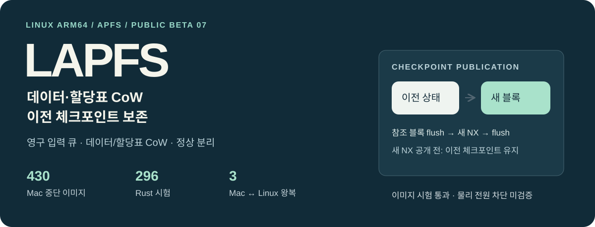
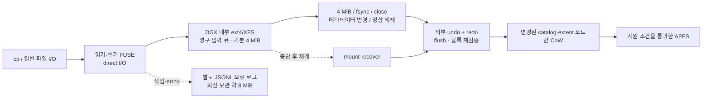

<p align="center"></p>

<p align="center">
  <a href="https://github.com/JUNJOONHWAN/LAPFS/releases"></a>
  
  <a href="LICENSE"></a>
</p>

# LAPFS

**Linux에서 APFS를 읽고, 작은 영구 버퍼에 쓰기를 모아 반영하는 실험적 파일시스템 도구.**

Designed for DGX Spark / GB10: readable APFS volumes, bounded durable write buffering, explicit recovery, and separate error logs. The canonical source and release build are maintained on DGX; macOS provides independent APFS validation.

> [!WARNING]
> **공개 실험 베타입니다. 중요한 데이터의 유일한 사본에 사용하지 마세요.**
> 이미지·가상 블록 장치와 선택한 외장 APFS 장치의 단일 쓰기·해제·재마운트 검증을 통과했습니다. **케이블 분리·전원 차단 내구성, 장시간 USB 쓰기 성능은 미검증**입니다. 일부 APFS/POSIX 기능은 의도적으로 거부합니다. 상용 드라이버 또는 Apple/NVIDIA 공식 제품이 아닙니다.
> **beta.4 검증 상태:** beta.3의 선택 장치 쓰기 시험에 더해, beta.4의 빈 폴더 삭제는 합성 이미지의 Linux FUSE·Mac fsck/SHA로 확인했습니다. 실제 Corsair 장치에 beta.4를 재마운트한 뒤 mkdir·cd·rmdir와 비어 있지 않은 폴더의 삭제 거부를 확인했습니다. beta.2에서 실패했던 약 1 TB 볼륨에 8 MiB 시험 파일을 쓰고 fsync·정상 해제·원시 읽기·재마운트·삭제까지 확인했습니다. 이 한 장치의 시험을 전원 차단 안전성이나 범용 APFS 호환성으로 확대 해석하지 마세요.

[시작하기](#빠른-시작) · [구조](#구조) · [목표와-현재-사양](#목표와-현재-사양) · [시험 결과](docs/VALIDATION.md) · [지원 제한](docs/LIMITATIONS.md) · [복구](docs/RECOVERY.md) · [English overview](docs/OVERVIEW.md)

## 왜 만들었나

APFS 외장 저장장치를 Linux ARM64에서 다루되, 내부 디스크에 전체 드라이브나 큰 파일을 복제하지 않는 것이 목표입니다. 쓰기 성공 응답 전에 입력을 영구 저장하고, 작은 배치로 반영하고, 중단된 작업의 복구 기록을 유지합니다.

## 구조



| 응답 시점 | 보장하는 범위 |
|---|---|
| `write()` 성공 | 입력 payload와 큐 메타데이터가 **DGX 영구 저장소에 저장**됨. USB에 모두 반영됐다는 뜻은 아님 |
| `fsync()` / close-flush 성공 | 해당 시점까지 큐 반영, 장치 flush, 변경 블록 읽기 재검증, commit 기록 완료 |
| 중단 / 오류 | 미완료 소유권·큐·복구 저널 보존. 복구 없이 원시 접근 금지 |
| 정상 해제 | 마지막 반영 후 소유권 해제. 해제 오류가 나면 복구 필요 |

**일부 데이터 블록은 외부 저널 아래에서 제자리 갱신합니다.** APFS native CoW만으로 복구되는 설계가 아닙니다. 미완료 장치를 Mac으로 옮기기 전에 DGX의 외부 저널로 복구해야 합니다.

## 목표와 현재 사양

| 항목 | 현재 beta.4 | 목표 / 남은 검증 |
|---|---|---|
| 기준 실행 환경 | DGX Spark / GB10, Linux ARM64, FUSE3 | 다른 배포판·USB 브리지 조합 검증 |
| 읽기 | 일반 파일, 디렉터리, 링크 조회, 큰 파일 범위 읽기 | 암호화·압축 스트리밍 확대 |
| 쓰기 | 생성·복사·범위 수정·append·파일 삭제·mkdir·빈 폴더 삭제(rmdir)·같은 폴더 파일 rename/replace | 더 넓은 POSIX/APFS 기능 |
| 쓰기 큐 | 기본 데이터 상한 **4 MiB** | 처리량·동시 작업 성능 측정 |
| 배치 복구 데이터 | undo + redo **32 MiB** 상한 | 대형 catalog에서 지원 범위 검증 |
| 내부 저장공간 | **1 GiB 여유 + 96 MiB 작업 여유 검사** | 최저공간·장기 반복 부하 실측 |
| 메모리 | 전체 파일/드라이브 staging 없음 | catalog·프로세스 총 RAM 상한은 미인증 |
| 오류 로그 | 2 MiB × 현재1 + 보관3, 약 **8 MiB** | 현장 장애 분류 확장 |
| 성능 | 합성 이미지: 5,000개 원본 보존 + 생성/변경/삭제 121.9초 | USB 3.2 지속 처리량 수치 **미제시** |
| macOS | 독립 `fsck_apfs` / 파일 SHA 검증 | macOS FUSE 제품 제공 안 함 |

공간 숫자는 각 계층의 제한이며 전체 작업 공간의 고정 사용량이나 파일시스템 전체 용량 보장은 아닙니다. 실패한 세션/복구 기록은 자동 삭제하지 않습니다.

## 빠른 시작

Linux ARM64, Rust/Cargo (DGX 검증: Rust 1.92.0), C 링커, Python 3, FUSE3(`/dev/fuse`, `fusermount3`)가 필요합니다. 먼저 **함께 제공한 합성 이미지**로 시험하세요.

```bash
git clone https://github.com/JUNJOONHWAN/LAPFS.git
cd LAPFS
cargo build --locked --offline --release --bin lapfs
./target/release/lapfs --version

# 새 시험 이미지 생성 → 실제 RW FUSE 기능/오류/강제종료 복구 검증
python3 tests/verify_linux_fuse.py --binary target/release/lapfs
```

배포 바이너리는 GNU/Linux ARM64, **glibc 2.39 이상과 libgcc_s**가 필요합니다. 다른 환경은 소스 빌드를 사용하세요.

이 검사는 `evidence/`에 별도 이미지를 만들고 결과를 남깁니다. 영구 큐 때문에 해당 위치는 **로컬 ext4/XFS**여야 합니다. 관리자 권한 없이 동작하는 FUSE 설정과 1 GiB 이상의 여유가 필요합니다. fixture 압축 해제 크기는 128 MiB입니다.

<details>
<summary><b>이미지 직접 마운트</b></summary>

```bash
mkdir -p work/mount
# 새 파일에만 압축을 풉니다. 기존 작업 이미지를 덮어쓰지 마세요.
python3 - <<'PY'
import gzip, shutil
with gzip.open('fixtures/block-test.dmg.gz', 'rb') as src, open('work/test.dmg', 'xb') as dst:
    shutil.copyfileobj(src, dst)
PY
# 제공 fixture의 APFS GPT 파티션 오프셋만 20480입니다.
./target/release/lapfs mount-rw work/test.dmg 20480 work/mount work/session-01
```

위 명령은 전경 실행합니다. 다른 터미널에서 파일을 쓰고, 열린 파일을 닫은 뒤 `fusermount3 -u work/mount`로 해제합니다. 정상 종료된 session 디렉터리는 새 마운트에 재사용하지 않습니다.
</details>

실제 장치는 by-id·컨테이너 UUID 등록 및 별도 내부 디스크 복구 경로가 필요합니다. [운영 및 복구 설명](docs/RECOVERY.md)을 먼저 확인하세요. 자동으로 드라이브를 검색해 쓰기 권한을 여는 명령은 제공하지 않습니다.

## 검증 상태

| 상태 | 범위 |
|---|---|
| ✅ | DGX 실제 FUSE: 큰 순차 복사, 범위 수정, 두 핸들 읽기 일관성, fsync/close, 기본 파일 작업 |
| ✅ | 실제 FUSE 프로세스 SIGKILL 후 승인된 데이터 복구, Apple fsck 및 파일 SHA 확인 |
| ✅ | 별도 관리자 loop 블록 장치 8/8 검사 — beta.1 결과 |
| ✅ | beta.3 큐 강제 종료 8지점 + 부분 반영 7지점; 모든 결과 Apple fsck/SHA 확인 |
| ✅ | beta.3 원본 5,000개 + 새 파일 600개 생성/200개 rename/300개 삭제, Mac 전수 해시 검증 |
| ✅ | beta.2 별도 오류로그/회전/동시 기록/정상 lookup 제외 |
| ✅ | 선택한 약 1 TB USB 볼륨: 8 MiB 시험 파일 쓰기·fsync·해제·원시 SHA·재마운트·삭제 |
| ⬜ | USB 분리·전원 차단·브리지 flush 거짓 성공 대응 |
| ⬜ | TB급 실제 볼륨 writer 처리량, 장기간 반복쓰기, 전체 APFS/POSIX 호환 |

각 결과의 빌드·범위·증거를 [검증 문서](docs/VALIDATION.md)에 구분했습니다. **이미지 시험 통과를 실제 전원 차단 안전성으로 해석하지 마세요.**

## 현재 지원하지 않는 것

- 암호화 볼륨 쓰기, 다중 볼륨 컨테이너, 스냅샷, CAB 간접 할당 구조 등 지원하지 않는 allocator layout.
- clone/hardlink/shared/compressed/sparse/특수 파일 변경, 미검증 xattr 변경.
- 디렉터리 rename/delete, 다른 폴더 간 rename, 열린 파일 삭제·열린 목적지 교체.
- `chmod/chown`, 명시적 timestamp/xattr/ACL 변경, 새 링크 생성, writable mmap.
- 새 크기 **8 MiB 초과 truncate**. 큰 파일 복사·append·범위 쓰기의 파일 크기 제한과는 다릅니다.
- `cp -a`, 데이터베이스, 임의 앱 저장 프로토콜 전체의 호환성 보장.

## 문서와 소스

```text
src/                 CLI · 읽기 · 영구 큐 · 복구 저널 · FUSE · 오류 로그
vendor/              수정된 APFS crates와 fuser
dependencies/       Cargo.lock의 registry 의존성 원본
tests/              Rust 회귀 / Linux FUSE / macOS 독립 검증
fixtures/           합성 APFS 이미지와 예상 파일 해시
docs/               구조 · 복구 · 제한 · 시험 증거
```

## 라이선스와 출처

**GPL-3.0-only** — [LICENSE](LICENSE). APFS 구현은 [apfs-explorer](https://github.com/enesilhaydin/apfs-explorer)의 고정 커밋을 기반으로 수정했습니다. FUSE 계층은 MIT 라이선스의 [fuser](https://github.com/cberner/fuser)를 사용합니다. [변경·출처 기록](UPSTREAM.md), [전체 의존성 고지](THIRD_PARTY_NOTICES.md)를 함께 제공합니다.

재배포 시 해당 라이선스·저작권 고지와 대응 소스를 보존하세요. 이 프로젝트는 Apple 또는 NVIDIA와 제휴하거나 이들의 인증을 받은 제품이 아닙니다.
