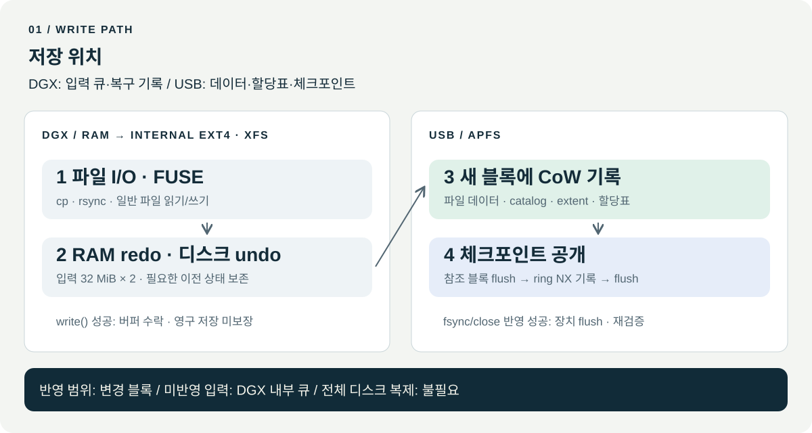
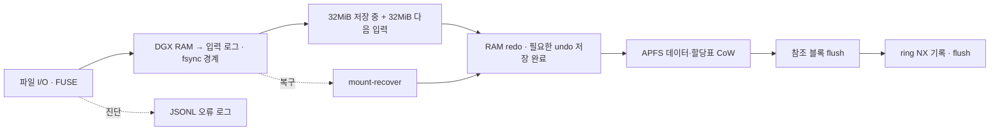
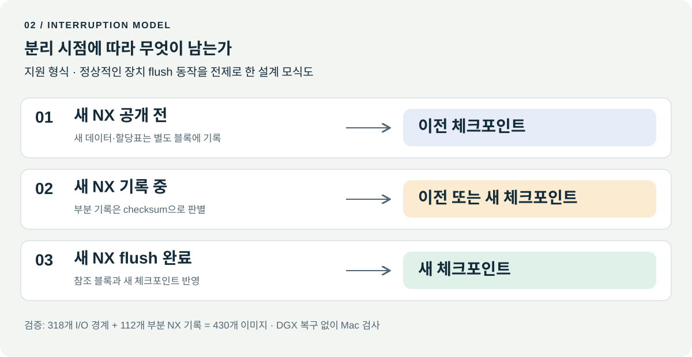

> **beta.16 후보** · 폴더 간 이동·연속 삭제 개선 · 시험 이미지/FUSE/Mac APFS 검사 통과 · Corsair 적용 대기. [변경·검증 보고서](docs/BETA16_MOVE_DELETE.md)

<p align="center"></p>
<p align="center">
  <a href="https://github.com/JUNJOONHWAN/LAPFS/releases/tag/v0.3.0-beta.16"></a>
  
  <a href="LICENSE"></a>
</p>

# LAPFS

**APFS 읽기·쓰기 · 묶음 쓰기 큐 · 데이터/할당표 CoW · Linux ARM64 공개 베타**

| 항목 | 내용 |
|---|---|
| 대상 | DGX Spark / GB10 · Linux ARM64 · FUSE3 |
| 기준 소스·빌드 | DGX |
| 독립 검증 | macOS `fsck_apfs` · 파일 SHA |
| 배포 상태 | 공개 실험 베타 · 상용 인증 없음 |
| 데이터 조건 | 별도 백업 필요 · 유일한 사본 사용 부적합 |
| 미검증 | 물리 전원 차단 · USB 브리지 캐시 신뢰성 · 장기 실장치 부하 |

[릴리스](https://github.com/JUNJOONHWAN/LAPFS/releases/tag/v0.3.0-beta.16) · [HTML 매뉴얼](docs/architecture.html) · [HTML 소스](docs/architecture.html) · [English overview](docs/OVERVIEW.md)

[저장 위치](#저장-위치) · [중단 처리](#중단-처리) · [사양](#사양) · [설치·시험](#설치시험) · [지원 제한](#지원-제한) · [검증](#검증)

## 읽기 경로

- 최대 8MiB RAM 선행 읽기 · 파일 1개 구간 캐시
- 쓰기·메타데이터 변경·복구 시 캐시 무효화
- [beta.10 읽기 성능·변경 전후 보고서](docs/READ_AHEAD.md)

## 쓰기 I/O

- 기본 FUSE 쓰기: RAM redo · 필요한 undo만 디스크 저장
- 원본 할당표 기준 빈 블록 undo 생략 · CoW·flush·재검증 유지
- 내부 이미지 기록량: 약 4.1배 → 1.06배 · 공간 재사용 8회 포함
- 실제 Corsair 256MiB 순차 쓰기: beta.14 112–118MiB/s · 1.29–1.30배 · 세 번의 활성화 시험
- [변경 전후·기록량·검증](docs/WRITE_AMPLIFICATION.md)

## 쓰기 정책

| 항목 | 기본값 `--grouped-writes` | `--durable-writes` |
|---|---|---|
| 일반 write | RAM 입력·redo · 필요한 undo 저장 | 연속 로그 · 매 write 동기화 |
| 영구 저장 | fsync · close · 정상 분리 | 각 write의 DGX 로그 · fsync/close의 APFS 반영 |
| 갑작스러운 분리 | 마지막 미동기화 입력 유실 가능 | DGX 로그 복구 필요 가능 |
| APFS 구조 | 데이터·할당표 CoW · 체크포인트 순서 | 동일 |
| 이전 세션 재개 | 저장된 정책 유지 · 정책 불일치 거부 | 동일 |

세션 v3: beta.13 이상 복구 · 이전 버전 사용 전 beta.13 정상 분리.

[beta.9 쓰기 변경·검증 이력](docs/SEQUENTIAL_IO.md)

## 저장 위치



[SVG 원본](docs/assets/lapfs-architecture.svg) · [PNG 그림](docs/assets/lapfs-architecture.png)

| 위치 | 저장 내용 | 기준 |
|---|---|---|
| DGX RAM → 내부 ext4/XFS | 입력·redo(RAM) · undo·복구 상태(디스크) | 논리 입력 32 MiB × 2 · 배치 복구 상한 128 MiB |
| 외장 APFS | 파일 데이터 · catalog · extent · 할당표 · 체크포인트 | 변경 블록 CoW · 참조 블록 flush · 새 NX 공개 |
| 별도 오류 로그 | 작업명 · errno · 오류 정보 | 현재 파일 + 보관 3개 · 약 8 MiB |

<details>
<summary>구조도 소스 · Mermaid</summary>



</details>

## 중단 처리



| 시점 | 상태 |
|---|---|
| `write()` 성공 · 기본 모드 | 버퍼 수락 · 영구 저장 미보장 · 갑작스러운 분리 시 미저장 내용 유실 가능 |
| `write()` 성공 · `--durable-writes` | DGX 입력 영구 저장 · USB 미반영 가능 |
| 새 NX 공개 전 | 기존 활성 체크포인트·참조 블록 보존 |
| 새 NX 기록 중 | checksum 기준 이전/새 체크포인트 선택 |
| `fsync()` / close 반영 성공 | 큐 반영 · 장치 flush · 변경 블록 재검증 · commit 기록 |
| 정상 해제 | 잔여 반영 · 소유권 해제 |
| 해제·복구 오류 | 큐·저널·소유권 기록 보존 · 강제 우회 금지 |

- 전제: 지원 APFS 형식 · 정상적인 장치 flush
- 미반영 입력 위치: 기본 모드 DGX RAM · durable 모드 내부 입력 로그
- 이전 체크포인트: 영구 스냅샷·별도 백업 아님
- beta.7 변경: 데이터·할당표 CoW / bootstrap·이전 spaceman 덮어쓰기 제거
- 근거: [구현·변경 영향·중단 시험](docs/NATIVE_COW_IMPACT.md)

## 사양

| 항목 | beta.16 후보 |
|---|---|
| 읽기 | 일반 파일 · 디렉터리 · 심볼릭 링크 · 4 GiB 초과 범위 읽기 |
| 파일 쓰기 | 생성 · 복사 · 범위 수정 · append · 닫힌 파일 삭제 · grouped 모드 연속 삭제 8개 묶음 |
| 디렉터리 | mkdir · 빈 폴더 rmdir |
| 이름 변경 | 같은 볼륨 내 파일·폴더 이동/rename · 닫힌 대상 교체 · Corsair 재검증 대기 |
| 메타데이터 | chmod · atime/mtime · 심볼릭 링크 생성/삭제 |
| 쓰기 큐 | 기본 논리 입력 32 MiB × 2 · 전체 RAM 상한 아님 |
| 배치 복구 기록 | undo + redo 상한 128 MiB |
| 내부 여유 공간 | 1 GiB 예비 공간 + 96 MiB 작업 여유 검사 |
| 전체 파일·디스크 staging | 불필요 |
| 총 RAM 상한 | 미인증 |
| 오류 로그 | 2 MiB × 4개 · 약 8 MiB |
| beta.14 USB 짧은 순차 쓰기 | 256MiB × 3회 · 112–118MiB/s · 장기 지속 속도 미검증 |
| macOS 역할 | 독립 검사 · macOS FUSE 드라이버 미제공 |

공간 수치: 계층별 제한 · 전체 사용량 보장 아님 · 실패 세션/복구 기록 자동 삭제 없음

## 설치·시험

### 요구 환경

- Linux ARM64 · `/dev/fuse` · `fusermount3`
- Rust/Cargo · C 링커 · Python 3
- DGX 검증 도구: Rust 1.92.0
- 배포 바이너리: glibc 2.39 이상 · libgcc_s
- 시험 경로: 로컬 ext4/XFS · 1 GiB 이상 여유
- 합성 fixture: 압축 해제 128 MiB

### 소스 빌드

```bash
git clone https://github.com/JUNJOONHWAN/LAPFS.git
cd LAPFS
cargo build --locked --offline --release --bin lapfs
./target/release/lapfs --version
```

### 합성 이미지 검사

```bash
python3 tests/verify_linux_fuse.py --binary target/release/lapfs
python3 tests/verify_rsync_archive.py --binary target/release/lapfs
```

출력 경로: `evidence/` · 대상: 별도 합성 이미지 · 실제 USB 변경 없음

### 시험 이미지 마운트

```bash
mkdir -p work/mount
python3 - <<'PY'
import gzip, shutil
with gzip.open('fixtures/block-test.dmg.gz', 'rb') as src, open('work/test.dmg', 'xb') as dst:
    shutil.copyfileobj(src, dst)
PY
# 제공 fixture 전용 APFS 오프셋: 20480
./target/release/lapfs mount-rw work/test.dmg 20480 work/mount work/session-01
```

- 실행 모드: 전경
- 정상 해제: 열린 파일 종료 후 `fusermount3 -u work/mount`
- 종료 세션 재사용: 불가 · 새 마운트별 새 session 디렉터리
- 실제 장치: by-id·컨테이너 UUID 등록 · 별도 내부 디스크 복구 경로
- 장치 절차: [운영·정상 분리·복구 매뉴얼](docs/RECOVERY.md)

### rsync 진행 표시

| 환경 | 옵션 |
|---|---|
| 공통 진행 표시 | `--progress` |
| `--info=progress2` | 지원 버전 전용 · Mac 기본 openrsync와 비호환 |
| 옵션 거부 오류 | 파일 전송 전 중단 · APFS 쓰기 단계 이전 |

## 검증

| beta.13 시험 | 결과 |
|---|---|
| Rust | 311개 통과 · 최종 Pipeline 추가 검사 |
| Mac | 60개 이미지 fsck·파일 SHA 통과 |
| 기록량 | 초기·재사용 공간 약 1.06배 · 내부 이미지 기준 |
| beta.13 Corsair 256MiB 1회 | 87.61MiB/s · 기록량 1.47배 · 전원 차단 미검증 |

| beta.14 실장치 | 확인 값 |
|---|---|
| 256MiB × 3회 | 112–118MiB/s · SHA 일치 · 기록량 1.29–1.30배 |
| beta.14 회귀 | Rust 312개 · Mac APFS 59개 이미지 통과 |

[beta.16 이동·삭제·검증](docs/BETA16_MOVE_DELETE.md) · [beta.15 실패 경계](docs/CROSS_DIRECTORY_MOVE.md) · [beta.14 변경·실장치 결과](docs/CHECKSUM_PERFORMANCE.md) · [beta.13 변경·검증 보고서](docs/WRITE_AMPLIFICATION.md)

### beta.7 검증 이력


| beta.7 시험 | 결과·범위 |
|---|---|
| **중단 이미지 430 / 430** | I/O 경계 318개 + 부분 NX 기록 112개 · DGX 복구 미사용 · Mac fsck·원본 104개 SHA·이전/새 상태 일치 |
| **Rust 296개** | 단위·회귀·실제 이미지 복구 · 자식 프로세스 전용 2개 항목: 부모 crash 시험에서 실행 |
| **Mac ↔ Linux 3회** | Mac 기록 → Linux 수정 → Mac fsck·내용·권한 검사 |
| **FUSE / rsync** | commit 배치 27개 · rsync 5단계 · Mac SHA·mode·나노초 mtime·링크·삭제 검사 |
| **272,629,778바이트 파일** | 512 MiB APFS 이미지 · 여러 할당 영역 기록 · Mac fsck·전체 SHA 일치 |
| **미검증** | 물리 전원 차단 · USB 캐시 거짓 성공 · TB급 장기 부하 · 전체 APFS/POSIX 호환 |

[변경 전후 보고서](docs/NATIVE_COW_IMPACT.md) · [바이너리·시험 영수증](docs/validation/native-cow-beta7.json) · [430개 사례](docs/validation/native-cow-beta7-matrix.json)

<details>
<summary>이전 베타 · 실장치 기록</summary>

- beta.5 / Corsair: rsync 5단계 · 이름 순회 오류 0건
- 순회 범위: 디렉터리 17,368개 · 파일 397,593개 · 링크 388개
- EIO 재검사: 795개 경로 통과
- beta.3/4 / 약 1 TB 장치: 8 MiB 파일 쓰기·fsync·해제·재마운트·삭제
- 적용 범위: 해당 빌드·장치 · beta.7 전원 차단 검증 아님
- 기록: [전체 이력](docs/VALIDATION.md) · [beta.6 정상 분리](docs/HANDOFF_AFTER.md)

</details>

## 지원 제한

- 볼륨: 암호화 쓰기 · 다중 볼륨 · 스냅샷 · CAB 간접 할당 등 미지원 구조
- 변경 대상: clone/hardlink/shared/compressed/sparse/특수/immutable/append-only 파일
- 파일 작업: 열린 파일 삭제·열린 목적지 교체 · 일부 특수 inode 변경
- 폴더 제거: 비어 있지 않은 폴더의 직접 제거 미지원 · 빈 폴더 rmdir 지원
- 권한·메타데이터: 다른 소유자로의 chown · 임의 xattr/ACL 변경 · hardlink 생성
- 기타: writable mmap · 8 MiB 초과 새 크기로 truncate
- 큰 파일: 복사·append·범위 쓰기에 8 MiB 전체 파일 제한 없음
- `rsync -a`: 일반 파일·디렉터리·심볼릭 링크 · 현재 사용자 소유권 범위
- 미보장: 전체 `cp -a` 메타데이터 · 데이터베이스 · 임의 앱 저장 프로토콜

상세: [지원·미검증 범위](docs/LIMITATIONS.md)

## 디렉터리

```text
src/                 CLI · 읽기 · 영구 큐 · 복구 저널 · FUSE · 오류 로그
vendor/              수정된 APFS crates · fuser
dependencies/        Cargo.lock registry 의존성 원본
tests/               Rust 회귀 · Linux FUSE · macOS 독립 검사
fixtures/            합성 APFS 이미지 · 예상 파일 해시
docs/                HTML 매뉴얼 · SVG/PNG 구조도 · 복구 · 제한 · 증거
```

## 라이선스·출처

| 구분 | 내용 |
|---|---|
| 프로젝트 | **GPL-3.0-only** · [LICENSE](LICENSE) |
| APFS 기반 | [apfs-explorer](https://github.com/enesilhaydin/apfs-explorer) 고정 커밋 · 수정본 |
| FUSE | [fuser](https://github.com/cberner/fuser) · MIT |
| 변경·출처 | [UPSTREAM.md](UPSTREAM.md) |
| 의존성 고지 | [THIRD_PARTY_NOTICES.md](THIRD_PARTY_NOTICES.md) |
| 재배포 | 해당 라이선스·저작권 고지·대응 소스 보존 |
| 제휴·인증 | Apple/NVIDIA 제휴·인증 없음 |
