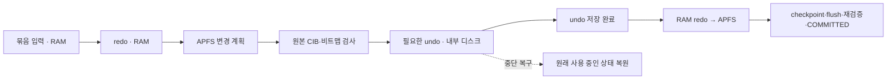

# beta.13 · 기록량 감소

## 변경 전 영향 보고서

| 항목 | 범위 |
|---|---|
| 기준 소스 | DGX `43cf181` · beta.12 |
| 기존 순차 기록 | 입력 WAL + undo + redo + APFS · 약 4.1–4.2배 |
| 수정 대상 | `journal.rs` · `buffered.rs` · `pipeline.rs` · `apfs_batch.rs` |
| 하위 변경 | apfs-core 장치 trait · apfs-write 할당 출처 전달 · 직접 관련 시험·문서 |
| 호출 경로 | FUSE → Pipeline → Session.write_group → RAM 계획·영구 undo → APFS → 검증·커밋 |
| 목표 | 큰 파일 순차 쓰기 총 기록량 2배 이하 |
| 검증 대상 | 별도 APFS 이미지 · 기존 Corsair 자료 변경 없음 |
| 실행 영향 | 실제 beta.12 마운트 유지 · 연구·모델·GPU·스케줄러 변경 없음 |

## 변경 후 영향 보고서

| 항목 | 결과 |
|---|---|
| 기본 FUSE 데이터 쓰기 | 입력 WAL 제거 · redo RAM 보관 · 순차·겹침·떨어진 범위 지원 |
| 이전 상태 | 필요한 undo 디스크 저장 · 저장 완료 전 APFS 변경 금지 |
| 원래 빈 블록 | 원본 CIB checksum·범위·원본 비트맵 검사 후 undo 생략 |
| 작업 중 해제된 블록 | 원본 비트가 사용 중이면 undo 유지 |
| 0인 undo | 동일 논리 길이·SHA의 희소 파일 구간 · 실제 0 기록 생략 |
| 기록 순서 | 원본 검증 → 영구 undo → APFS CoW → checkpoint flush → 재검증 → COMMITTED |
| 중단 복구 | PREPARED 취소 · APPLYING/RECOVERING undo 복구 · COMMITTED 되돌림 금지 |
| 중단 후 빈 블록 | 미참조 새 데이터 잔존 가능 · 원래 사용 중인 바이트 복원 |
| durable-writes | 기존 입력 WAL·디스크 undo/redo 유지 |
| 독립 배치 CLI·메타데이터 | 기존 저널 경로 유지 |
| APFS 블록 형식 | 변경 없음 · 기존 데이터/할당표 CoW 유지 |
| 세션 형식 | 신규 기본 데이터 경로 v3 · v1/v2 읽기·복구 지원 |
| 다운그레이드 | beta.13 정상 분리 선행 · 미완료 v3 세션은 beta.13 이상으로 복구 |
| 실제 Corsair | beta.13 적용·실장치 처리량 검사 대기 |

- RAM redo: 배치 저널 상한으로 제한 · 총 프로세스 RAM 상한 인증 아님
- 기본 논리 입력: 32MiB 두 묶음 · 준비·검증·메타데이터 메모리 별도
- 일반 write 성공: 미저장 입력 유실 가능 · 기존 grouped 정책 유지
- fsync/close 성공: APFS 반영·flush·재검증 완료
- 2배 목표: 큰 순차 전송의 측정 기준 · 작은 파일·메타데이터 작업 전체 보장 아님

## 성능

DGX 내부 ext4 · 1GiB APFS 이미지 4개 · 파일당 256MiB · beta.12/beta.13/beta.13/beta.12 · 동일 난수 입력 · fsync/close 포함 · SHA 일치. MB/s = 1,000,000바이트/초.

| write 크기 | beta.12 MB/s | beta.13 MB/s |
|---|---|---|
| 10KiB | 35.94 / 34.28 | 102.11 / 134.66 |
| 1MiB | 40.90 / 58.30 | 177.22 / 101.50 |

| 기록량 | 결과 |
|---|---|
| beta.12 | 약 4.10–4.20배 |
| beta.13 · 초기 공간 | 약 1.06배 |
| beta.13 · 8회 공간 재사용 | 1.0569–1.0588배 |
| 재사용 처리량 | 81.14–165.79MB/s · 부하·캐시 미통제 |
| 실제 Corsair | 미측정 |
| SSD 내부 NAND 기록량 | 미측정 · OS 기록량과 별개 |

기록량 기준: `/proc/<daemon>/io`의 `write_bytes` 증가 ÷ 입력 바이트. 내부 로그와 대상 이미지 합계. 단일 daemon에서 저장 완료까지 측정. SSD 컨트롤러 내부 증폭·다른 프로세스의 파일시스템 공용 저널 비용은 포함하지 않음.

초기 구현 이력: RAM redo + 전체 undo의 새 공간 약 1.1배, 재사용 공간 2.08–2.09배. 원본 할당표 검증을 추가한 최종 구현에서 재사용 공간도 약 1.06배. 최종 시험 중 별도 시험·이미지 압축 미실행. 사용자 작업 유지·시스템 전체 부하 미통제.

[전체 측정](validation/beta13-throughput.json)

## 검증

| 항목 | 결과 |
|---|---|
| Rust workspace·명시 fixture | 311 통과 · 최종 Pipeline 추가 재검사 통과 |
| 신규 로그 검사 | RAM redo 손상·누락 재실행 거부 · 찢어진 기록 undo 복구 |
| 희소 undo | 혼합 데이터·끝 0 구간·저장 실패 복구 |
| 원본 할당표 | dirty bitmap의 해제 상태 무시 · 원래 사용 중인 블록 undo 유지 |
| 중단 경계 | 기존 30개 + 새 Pipeline 10개 |
| 복구 바이트 검사 | 변경 허용 범위: 원본 할당표로 확인된 빈 블록만 |
| FUSE | 25항목 · O_SYNC/O_DSYNC · 다중 append · 디렉터리 fsync |
| rsync | 초기·반복·교체·링크 변경·삭제 5단계 |
| 정상 분리 | grouped·durable·기본 정책 · dead daemon 복구 |
| Mac 독립 검사 | 기능·복구 55 + 성능 5 = 60 이미지 · fsck clean · 원본104/변경 파일 SHA |
| Mac 먼저 검사한 중단 이미지 | 새 Pipeline 10 + O_SYNC/O_DSYNC 2 · Linux 복구 전 사본 |
| 물리 정전·USB 캐시 소실 | 미검증 |
| linux-apfs-rw 동일 조건 성능 비교 | 미실시 |

시험 실행 오류 이력: 첫 최종 테스트 실행의 출력 디렉터리 누락 → 디렉터리 생성 후 전체 재실행. 해당 실패 로그 보존. 초기 prototype 결과와 최종 결과 분리. 사용자 자료 삭제 없음 · 완료된 시험 이미지만 SHA 검증 후 압축 보관.

[시험 요약](validation/beta13-tests.json) · [Mac 결과](validation/beta13-native.json)

## 기준 자료

- [Apple File System Reference](https://developer.apple.com/support/apple-file-system/Apple-File-System-Reference.pdf): Space Manager · CIB·chunk 구조
- [linux-apfs-rw spaceman.c](https://github.com/linux-apfs/linux-apfs-rw/blob/923526a669d7c7d0d209c904436db3a3b8d14e97/spaceman.c): 빈 블록 할당 · 이전 CIB/bitmap CoW 처리 참고
- 새 구현의 안전성 근거: 자체 소스 검사·오류 주입·Mac 독립 검사 · 참고 프로젝트의 보증 이전 아님

## 바이너리

- SHA-256: `c6131a12dd2f4bc8aa546053e3679ddf261489a56303aa99a33015b6032de6e0`
- DGX Linux ARM64 · Rust 1.92.0 · release · fault-injection 비활성
- 새 외부 의존성·라이선스 변경 없음
