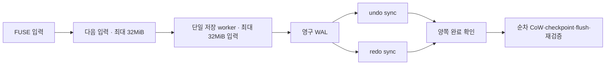

# beta.12 · 병렬 동기화·쓰기 파이프라인

## 변경 전 영향 보고서

| 항목 | 범위 |
|---|---|
| 기준 | DGX `ead985db` · beta.11 후보 · 실제 Corsair beta.10 |
| 수정 대상 | journal · FUSE host · 신규 pipeline · 직접 관련 시험·버전·문서 |
| 호출 경로 | FUSE → Pipeline → 단일 Session worker → WAL → undo/redo → CoW → checkpoint → 재검증 |
| 목표 | 독립 undo/redo 동기화 중첩 · 이전 배치 저장 중 다음 입력 수신 |
| 자료 영향 | 별도 APFS 시험 이미지 · 실제 Corsair 기존 자료 변경 없음 |
| 실행 영향 | 연구·GPU·모델·스케줄 변경 없음 · 기존 전송 중단 없음 |

## 변경 후 영향 보고서

| 항목 | 결과 |
|---|---|
| 동기화 | undo/redo 병렬 실행 · 양쪽 성공 확인 후 PREPARED·대상 기록 |
| 쓰기 버퍼 | 기본 32MiB × 2 논리 입력 · 저장 중 1개 + 수신 중 1개 |
| 포화 처리 | 이전 저장 완료 대기 · 무제한 큐 없음 |
| APFS 변경 | 단일 worker 순차 커밋 · 장치 소유권 유지 |
| 오류 | worker 실패·종료·체크섬 손상 전파 · 후속 성공 응답 차단 |
| 조회 | pending 읽기 합성 · attr/list/read/space 조회로 추가 저장 강제 방지 |
| 저장 완료 | fsync · close · 정상 분리에서 두 버퍼 완료 대기 |
| durable 옵션 | 매 write의 기존 로컬 WAL 영구 저장 유지 |
| 복구 형식 | 기존 세션·저널 형식 유지 |
| 실장치 | beta.10 유지 · beta.12 교체·성능 검사 대기 |

- 64MiB: 논리 입력 용량 · 전체 RAM 상한 아님
- 추가 RAM: worker 내부 복사·검증·APFS 메타데이터·읽기 캐시
- 디스크 복구 상한: 기존 배치 128MiB 유지
- 일반 write 성공: RAM 수락 가능 · 영구 저장 완료 미보장
- 32MiB 경계: 비동기 저장 제출 · 영구 저장 보장 경계 아님

## 성능

DGX 내부 ext4 · 1GiB APFS 이미지 4개 · 파일당 256MiB · 실제 FUSE · beta.11/beta.12/beta.12/beta.11 순서 · SHA 일치. 쓰기 시간: fsync/close 포함. 단위 MB/s = 1,000,000바이트/초.

| write 크기 | beta.11 MB/s | beta.12 MB/s |
|---|---|---|
| 10KiB | 59.70 / 36.21 | 39.41 / 48.78 |
| 1MiB | 31.28 / 29.60 | 48.29 / 41.88 |

- 1MiB write: 이번 시험에서 개선 관측
- 10KiB write: 편차 큼 · 개선 미확인
- 읽기+SHA: beta.11 311–899MB/s · beta.12 314–850MB/s · 캐시 미통제 · 읽기 우열 미판정
- 실제 Corsair 쓰기 속도: 미측정
- linux-apfs-rw 동일 조건 비교: 미실시 · 우위 주장 없음
- daemon write_bytes: 입력 256MiB당 약 1.10–1.13GB · 전체 경로 비용 · USB 단독 기록량 아님
- 남은 비용: WAL/undo/redo · APFS 준비·재검증 · 동기화 · 내부 SSD/USB 부하
- USB 20Gbps: 링크 사양 · 파일 전송 2,500MB/s 보장 아님

[전체 측정](validation/beta12-throughput.json)

## 검증

| 시험 | 결과 |
|---|---|
| Rust workspace·명시 fixture | 308 통과 |
| 중첩 | worker 정지 중 다음 입력 수신 · fsync 완료 대기 |
| 오류 | worker 오류·panic·연결 종료·RAM checksum 손상 |
| 조회 간섭 | attr/list/space/pending read 후 backing image SHA 불변 |
| 종료 경계 | 기존 30개 + pipeline 7개 |
| FUSE | 기존 25항목 · O_SYNC/O_DSYNC · 다중 append · 디렉터리 fsync |
| rsync | 초기·반복·교체·링크 변경·삭제 5단계 |
| handoff | grouped·durable·기본 정책 정상 분리 · dead worker 복구 |
| Mac | 42 기능·복구 이미지 + 4 성능 이미지 · fsck clean · 원본/변경 SHA |
| 실제 정전·USB 캐시 소실 | 미검증 |
| 장기 실장치 부하·상용 인증 | 미검증 |

시험 과정: 초기 탐색 명령의 마운트 재귀 조회 확인·해당 검사 프로세스 종료. 프로토타입 조회가 pending 데이터를 강제 저장하는 문제 수정·회귀 시험 추가. 최종 ABBA 중 별도 시험·압축 작업 미실행. 시스템 전체 부하·캐시 통제 없음.

[시험 요약](validation/beta12-tests.json) · [Mac 결과](validation/beta12-native.json)

## 바이너리

- SHA-256: `89ad6da18aafcfe19d8975c5aabe0a15c3c10491e4f08c146f104dbb13e971b6`
- 빌드: DGX Linux ARM64 · Rust 1.92.0 · release · fault-injection 비활성
- 시험 전용 fault-injection 빌드: 배포 제외
- 의존성·라이선스: 변경 없음
